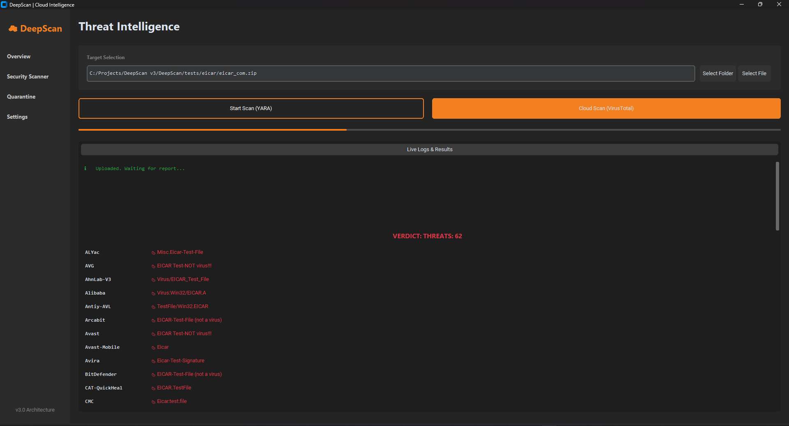

<div align="center">

# DeepScan

**Desktop malware scanner with a local YARA engine and VirusTotal cloud lookup**


</div>

DeepScan combines two detection approaches in one desktop app: fast **offline scanning** with community YARA rules, and **cloud analysis** through the VirusTotal API (70+ antivirus engines). The YARA rule set updates itself in the background, downloading data only when a new release is published.

<p align="center">
  
</p>

## Features

- **Local YARA scanning** of a single file or an entire folder, using the [YARA-Forge](https://github.com/YARAHQ/yara-forge) *full* rule set (thousands of rules).
- **Smart auto-update.** The latest release tag is checked at startup and every 6 hours. The archive is downloaded only if the tag differs from the local version, so an up-to-date database costs one lightweight request.
- **Safe database replacement.** A new rule set is validated by compiling it before it atomically replaces the old one. A failed or partial download never breaks a working database.
- **Fast startup.** Rules are loaded in a background thread from a compiled cache, so the UI never freezes.
- **VirusTotal cloud scan** with a per-engine verdict table.
- **Quarantine.** Detected files are moved to an isolated folder and can be restored to their original location or permanently deleted.
- **Responsive UI.** All scans run in worker threads. Live log panel, dark/light theme, interface in **English, Russian and Turkmen**.

## Architecture

```text
DeepScan/
├── main.py                       # entry point
├── src/deepscan/
│   ├── config.py                 # paths, settings, translations
│   ├── core/
│   │   ├── yara_engine.py        # rule loading, scanning, auto-update
│   │   └── quarantine.py         # quarantine and restore logic
│   └── ui/
│       └── app.py                # CustomTkinter interface
├── tests/eicar/                  # safe antivirus test file
├── screenshots/
├── .env.example
└── requirements.txt
```

Runtime data (rules, compiled cache, quarantine, logs) is stored in a `data/` folder next to the project and is excluded from Git.

### How the update works

```text
start ─► load cached rules (background)
     └─► fetch latest release tag ── same as local? ── yes ─► done
                                          │ no
                                          ▼
                       download ► verify size ► compile ► atomic replace ► reload
```

## Getting started

**Requirements:** Windows, Python 3.10+, and (optionally) a free [VirusTotal API key](https://www.virustotal.com/gui/join-us) for cloud scans.

```bash
git clone https://github.com/Meret113/DeepScan.git
cd DeepScan

python -m venv .venv
.venv\Scripts\activate
pip install -r requirements.txt
```

Create your configuration file:

```bash
copy .env.example .env
```

Then edit `.env`:

```ini
VT_API_KEY=your_virustotal_api_key
# PROXY_URL=http://127.0.0.1:10809   # optional
```

Run the app:

```bash
python main.py
```

On the first launch DeepScan downloads the rule set automatically. Local scanning works without any API key.

## Usage

1. Open **Security Scanner** and choose a file or a folder.
2. Click **Start Scan (YARA)** for an offline scan, or **Cloud Scan (VirusTotal)** for a multi-engine report.
3. Review the results in the live log. Threats found by YARA are moved to **Quarantine**, where you can restore or delete them.
4. The current database version is shown on the **Overview** page. **Settings → Update Database** triggers a manual check.

### Verify that it works

The repository includes the standard [EICAR](https://www.eicar.org/) test file in `tests/eicar/`. It is harmless, but every antivirus flags it, so extract it and scan it to confirm the detection pipeline.

> Windows Defender may quarantine the file on extraction. Add an exclusion for the folder if needed.

## Tech stack

| Component | Purpose |
|-----------|---------|
| Python 3.10+ | application language |
| yara-python | rule compilation and matching |
| CustomTkinter | modern desktop UI |
| requests | GitHub and VirusTotal APIs |
| python-dotenv | configuration from `.env` |
| threading | non-blocking scans and background updates |

## Limitations and roadmap

- YARA-Forge is a broad community rule set, so occasional false positives are possible. Review detections before deleting files.
- Windows is the tested platform.
- Planned: unit tests for the quarantine and update logic, scan report export, confirmation before quarantining.

## Security notes

Never commit your `.env` file. It is listed in `.gitignore`. Only `.env.example` with a placeholder belongs in the repository.

## Author

**Meret** · [github.com/Meret113](https://github.com/Meret113)

## License

## License

MIT. See [LICENSE](LICENSE).

The VirusTotal cloud scan uses the free public API, which VirusTotal permits
for non-commercial use only. Files uploaded for a cloud scan are processed by
VirusTotal under its own terms. Use your own API key.